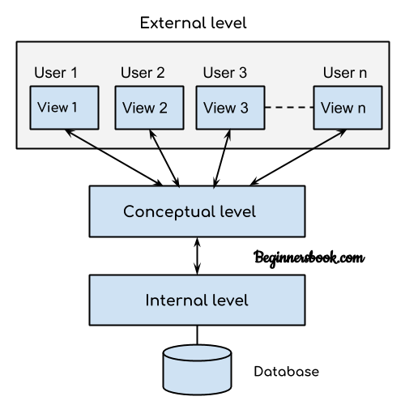

# Chunk 1: Fundamentals & Database Architecture

* **Core Concepts:** Data vs. Information, Database, DBMS, RDBMS. Advantages and disadvantages of using a DBMS over a file system.
* **Architecture:** 3-Schema Architecture (Physical, Logical, and View levels).
* **Data Independence:** Logical Data Independence vs. Physical Data Independence.
* **Database Languages:** DDL, DML, DCL, TCL, DQL.
* **Database Users & Admin:** DBA roles and responsibilities.

## 1. Core Concepts & The "Why" of Databases

* **Data vs. Information:** Data is raw, unorganized facts (e.g., 100, John). Information is processed, structured data that provides context (e.g., User John has 100 points).
* **DBMS vs. RDBMS:** A DBMS (Database Management System) manages data storage. An RDBMS (Relational DBMS) specifically stores data in a tabular format (rows and columns) enforcing relationships via Primary and Foreign Keys.

**Why DBMS over File Systems? (Crucial for Interviews):**
* **Data Redundancy:** File systems duplicate data across files; DBMS uses normalization to store it once.
* **Data Integrity:** DBMS enforces rules (e.g., "Age cannot be negative").
* **Concurrency:** DBMS allows multiple users to read/write simultaneously using locks and ACID properties; file systems often overwrite each other.
* **Security:** DBMS provides granular, row/column-level access control.

## 2. The 3-Schema Architecture

This architecture separates the user application from the physical database, ensuring that changes in one layer do not break another. It enables multiple users to access the same data with a personalized view while storing the underlying data only once.

* **External/View Level (The Top):** What the end-user or API sees. It hides the rest of the database. *(Example: A React frontend dashboard or an SEO analytics view that only shows aggregated metrics, hiding user PII).*
* **Conceptual/Logical Level (The Middle):** The blueprint. Defines what data is stored and the relationships among them. Software Engineers and Database Designers live here. *(Example: ER Diagrams, defining tables, columns, and datatypes).*
* **Internal/Physical Level (The Bottom):** How the data is actually stored on the hardware. It describes the physical storage structure of the DB. *(Example: SSDs, B+ tree indexes, data compression).*

## 3. Data Independence
This is the direct benefit of the 3-Schema Architecture. It is the ability to modify schema definition in one level without affecting schema definition in the next higher level.

* **Logical Data Independence:** Changing the Conceptual level without breaking the External view.
  * *Example:* Adding a new `DateOfBirth` column to the `Users` table. Your existing API endpoints (Views) that only fetch `Username` will not break.
* **Physical Data Independence:** Changing the Internal level without breaking the Conceptual level.
  * *Example:* Moving your database from an HDD to an NVMe SSD, or changing a B-Tree index to a Hash index to improve speed. The SQL queries you write remain exactly the same.

## 4. Database Languages (The SQL Sub-languages)
*Interviewers will often give you a SQL command and ask which category it belongs to.*

* **DDL (Data Definition Language):** Modifies the structure/schema. (Auto-commits in most databases).
  * *Commands:* `CREATE`, `ALTER`, `DROP`, `TRUNCATE` (removes all rows but keeps the table structure).
* **DML (Data Manipulation Language):** Modifies the data inside the tables.
  * *Commands:* `INSERT`, `UPDATE`, `DELETE`.
* **DQL (Data Query Language):** Fetches data. (Often grouped with DML, but technically distinct).
  * *Commands:* `SELECT`.
* **TCL (Transaction Control Language):** Manages transactions to ensure ACID properties.
  * *Commands:* `COMMIT` (save changes), `ROLLBACK` (undo changes), `SAVEPOINT`.
* **DCL (Data Control Language):** Manages security and user permissions.
  * *Commands:* `GRANT`, `REVOKE`.

---

# Chunk 2: Data Modeling (ER & EER Models)

* **Entities:** Strong vs. Weak Entities, Entity Sets.
* **Attributes:** Simple, Composite, Single-valued, Multi-valued, Derived, and Stored attributes.
* **Relationships:** Relationship Sets, Degree of Relationship (Unary, Binary, Ternary).
* **Constraints:** Mapping Cardinalities (1:1, 1:N, N:1, M:N) and Participation Constraints (Total vs. Partial).
* **Keys:** Super Key, Candidate Key, Primary Key, Alternate Key, Foreign Key.
* **Extended ER (EER):** Specialization, Generalization, and Aggregation.

## ER Model
It is a high data model based on a perception of a real world that consists of a collection of basic objects, called entities, and of relationships among these objects. The graphical representation of an ER Model is an ER Diagram, which acts as a blueprint of the DB.

## 1. Entities (The Nouns)
An entity is an object that exists in the real world and has its own independent existence (e.g., a User, a Website, an API_Key).

* **Strong Entity:** Can stand entirely on its own. It has its own Primary Key. *(Example: User).*
* **Weak Entity:** Cannot exist without a strong entity (its "owner"). It does not have a primary key of its own, only a "partial key". *(Example: An Order_Item cannot exist without an Order. If you delete the order, the item vanishes).*

## 2. Attributes (The Adjectives)
Attributes describe the properties of an entity.

* **Simple vs. Composite:**
  * *Simple:* Cannot be divided further (e.g., Age).
  * *Composite:* Can be broken down (e.g., Address breaks into Street, City, ZipCode).
* **Single-valued vs. Multi-valued:**
  * *Single:* One value per entity (e.g., DateOfBirth).
  * *Multi-valued:* Multiple values allowed (e.g., PhoneNumbers, TechStack). *System Design Note: In SQL, multi-valued attributes usually force you to create a separate table to maintain 1NF.*
* **Derived vs. Stored:**
  * *Stored:* Physically saved on the disk (e.g., DateOfBirth).
  * *Derived:* Calculated on the fly and not stored to save space and prevent update anomalies (e.g., calculating Age from DateOfBirth or calculating Total_Visits from raw traffic logs).

## 3. Relationships (The Verbs)
How entities interact with each other (e.g., User owns Website).
**Degree of Relationship:** The number of entity types involved.

* **Unary (Degree 1):** An entity relates to itself. *(Example: An Employee table where an employee "Manages" another Employee).*
* **Binary (Degree 2):** Two entities. *(Example: User registers Domain).*
* **Ternary (Degree 3):** Three entities. *(Example: Developer uses Framework on a Project).*

## 4. Constraints (The Rules of the Game)
This is exactly how you decide whether to put a Foreign Key in Table A, Table B, or create a brand-new joining table.

* **Mapping Cardinalities:**
  * **1:1 (One-to-One):** A User has one Profile. (Put the foreign key in either table).
  * **1:N (One-to-Many):** A User publishes many BlogPosts. (Put the foreign key on the "Many" side—the BlogPost table gets a UserID column).
  * **M:N (Many-to-Many):** Students enroll in many Courses; Courses have many Students. (You must create a third "Junction/Mapping" table, like Enrollments, containing both Primary Keys).
* **Participation Constraints:**
  * **Total (Mandatory):** Every entity must participate. *(Example: Every Employee MUST belong to a Department).*
  * **Partial (Optional):** Not every entity has to participate. *(Example: An Employee MIGHT manage a Department, but most don't).*

## 5. Keys (The Identifiers)

### Sample Data
**Employees Table:**

| EmpID | Email | PassportNo | Name | DeptID |
| :--- | :--- | :--- | :--- | :--- |
| 101 | alice@faang.com | P-111 | Alice | D-1 |
| 102 | bob@faang.com | P-222 | Bob | D-1 |
| 103 | charlie@faang.com | P-333 | Charlie | D-2 |
| 104 | alice.w@faang.com | P-444 | Alice | D-3 |

**Departments Table:**

| DeptID | DeptName |
| :--- | :--- |
| D-1 | Engineering |
| D-2 | Marketing |
| D-3 | Sales |

### How the Keys Apply to This Data
Here is exactly how you would explain these keys using the data above in an interview.

**1. Super Key** (Any combination that guarantees uniqueness)
* **The Rule:** If I use this combination of columns in a `WHERE` clause, will I always get exactly one row back? It can include extra, useless columns.
* **Example:** `{EmpID, Name}` is a Super Key. If I query `WHERE EmpID = 101 AND Name = 'Alice'`, I get exactly row 1. Even though the Name column isn't strictly necessary to find her, the combination still successfully identifies a single row.

**2. Candidate Key** (The "Minimal" Super Key)
* **The Rule:** It guarantees uniqueness, but if you remove even one column from it, it breaks.
* **Example:** `EmpID` alone, `Email` alone, or `PassportNo` alone. 
* *Why isn't Name a Candidate Key?* Because if I query `WHERE Name = 'Alice'`, the database returns two rows (101 and 104). It is not unique.

**3. Primary Key** (The Chosen One)
* **The Rule:** The single Candidate Key the database designer selects to officially identify the rows.
* **Example:** We select `EmpID`. *Why?* Because it is a short integer. Searching through numbers is much faster for a database CPU than searching through strings like an Email or PassportNo.

**4. Alternate Key** (The Runners-Up)
* **The Rule:** The Candidate Keys that were not chosen to be the Primary Key.
* **Example:** `Email` and `PassportNo`. Even though they aren't the Primary Key, we still don't want duplicates. In SQL, you apply a `UNIQUE` constraint to these columns so nobody else can register alice@faang.com.

**5. Foreign Key** (The Bridge)
* **The Rule:** A column that points to the Primary Key of a different table to enforce Referential Integrity.
* **Example:** `DeptID` in the Employees table. Notice how Alice (101) and Bob (102) both have `DeptID = D-1`. This points to the Departments table, meaning they are both in Engineering.
* **The Enforcement:** Because DeptID is a Foreign Key, if you try to insert a new employee with `DeptID = D-99`, the database will throw a hard error and block the insertion, because D-99 does not exist in the Departments table.

## 6. Extended ER (EER) - Advanced Object-Oriented Modeling
EER introduces concepts from object-oriented programming (like inheritance) into database design.

* **Specialization (Top-Down):** Taking a broad entity and breaking it down into specific subclasses. (Entity Set -> Sub Entity Sets).
  * *Example:* You have a `User` entity. You specialize it into `Admin_User` and `Standard_User`. They inherit all attributes of User but have their own unique attributes.
* **Generalization (Bottom-Up):** The exact reverse. You notice Cars and Motorcycles share similar attributes (wheels, engine size), so you group them up into a generalized `Vehicle` entity. (Sub Entity Sets -> Entity Set). Makes DB more refined and simpler; common attributes are not repeated.
* **Aggregation:** Treating an entire relationship between two entities as if it were a single entity itself.
  * *Example:* An `Interview` is a relationship between a `Candidate` and an `Interviewer`. You can "aggregate" that relationship and attach it to a `Job_Offer` entity.
* **Attribute Inheritance:** Both specialization and generalization have attribute inheritance. The attributes of higher-level entity sets are inherited by lower-level entity sets.
  * *Example:* Customers and Employees inherit the attributes of `Person`.

---

# Chunk 3: Relational Model & Relational Algebra

* **Relational Concepts:** Schema, Instance, Domain, Tuples, Arity, Cardinality.
* **Integrity Constraints:** Domain, Entity, and Referential Integrity.
* **Relational Algebra (Fundamental):** Select, Project, Union, Set Difference, Cartesian Product, Rename.
* **Relational Algebra (Derived):** Intersection, Division, and all types of Joins (Inner, Outer, Natural, Theta, Equi).
* **Relational Calculus:** Tuple Relational Calculus (TRC) and Domain Relational Calculus (DRC).

## 1. Relational Concepts (The Vocabulary)
If an interviewer uses academic terms, you need to instantly map them to standard SQL terms.
* **Schema:** The physical blueprint of the table (the column names and their data types). It rarely changes.
* **Instance:** A snapshot of the actual data inside the table at this exact second. It changes constantly.
* **Domain:** The set of allowable values for a column. *(Example: The domain for a Month column is integers 1 through 12).*
* **Tuple:** A single Row (or record) in a table.
* **Arity (or Degree):** The total number of Columns in a table. *(Mnemonic: Arity -> Attributes).*
* **Cardinality:** The total number of Rows in a table. *(Mnemonic: Cardinality -> Count of records).*

## 2. Integrity Constraints (The Guardrails)
These are the three absolute laws that keep data from becoming corrupted.

* **Domain Integrity:** Ensures a column only holds valid data types and ranges. *(Example: A Price column cannot hold the text string "Free", and an Age column cannot be negative).*
* **Entity Integrity:** Ensures every row is uniquely identifiable. **Rule:** The Primary Key cannot be NULL, and it must be unique.
* **Referential Integrity:** Ensures relationships between tables remain valid. **Rule:** A Foreign Key must either perfectly match an existing Primary Key in the parent table, or it must be NULL. You cannot have "orphan" records pointing to a parent that doesn't exist.

## 3. Relational Algebra (The Engine of SQL)
Relational Algebra is procedural—it tells the database step-by-step how to fetch the data.

### Fundamental Operations (The Building Blocks)
These are the 6 basic operations from which everything else is built.

| Algebra Symbol & Name | What it does | The SQL Equivalent |
| :--- | :--- | :--- |
| **Select (σ)** | Filters **Rows** based on a condition. | The `WHERE` clause. |
| **Project (π)** | Filters **Columns**. Plucks out only the specific columns you want. | The `SELECT col1, col2` clause. |
| **Union (∪)** | Combines rows from two tables, removing duplicates. Tables must have the exact same columns. | `UNION` |
| **Set Difference (−)** | Returns rows that are in Table A but NOT in Table B. | `EXCEPT` (or `MINUS` in Oracle). |
| **Cartesian Product (×)** | Multiplies every row in Table A with every row in Table B. *(If A has 10 rows and B has 10, you get 100 rows).* | `CROSS JOIN` |
| **Rename (ρ)** | Renames a table or column temporarily for the query. | `AS` (Aliasing). |

## 4. Relational Calculus (Low Priority - Skim Only)
While Relational Algebra is procedural (how to get the data), Relational Calculus is declarative—it just describes *what* data you want, without explaining *how* to calculate it. (SQL is largely based on calculus).

* **Tuple Relational Calculus (TRC):** Filters data by looking at entire tuples (rows) at a time.
* **Domain Relational Calculus (DRC):** Filters data by looking at specific domains (columns) at a time.

> **Interview Prep Note:** You do not need to memorize the complex mathematical syntax for these. Just know the difference between Procedural (Algebra) vs. Declarative (Calculus).