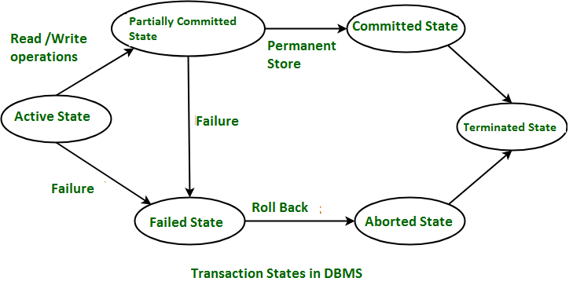
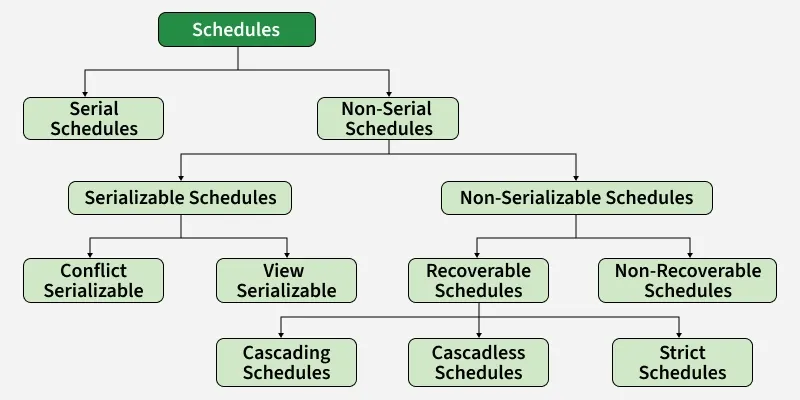

# Chunk 9: Transaction Management & Concurrency Control

* **Transactions:** The Transaction State Diagram (Active, Partially Committed, Committed, Failed, Aborted).
* **ACID Properties:** Atomicity, Consistency, Isolation, Durability.
* **Schedules:** Serial, Non-Serial, Serializable (Conflict Serializability vs. View Serializability), Recoverable, Cascadeless, Strict.
* **Concurrency Anomalies:** Dirty Read, Lost Update, Unrepeatable Read, Phantom Read.
* **Concurrency Control Protocols:**
    * Lock-Based: Shared/Exclusive Locks, Two-Phase Locking (2PL - Strict, Rigorous, Conservative).
    * Timestamp-Based: Thomas Write Rule.
    * Multiversion Concurrency Control (MVCC).
* **Isolation Levels:** Read Uncommitted, Read Committed, Repeatable Read, Serializable.
* **Deadlocks:** Wait-For Graphs (Detection), Wait-Die & Wound-Wait schemes (Prevention).

> **Note:** Think of a transaction as a single logical unit of work. For example, transferring money from Account A to Account B is one transaction, even though it involves multiple steps (checking balance, deducting from A, adding to B).

---

## 1. Transactions & The State Diagram

A transaction goes through specific states during its lifecycle.

* **Active:** The transaction has just started and is currently executing its instructions.
* **Partially Committed:** The transaction has executed its final operation, but the changes are still in memory and haven't been permanently saved to the disk yet.
* **Committed:** Success! The changes are permanently saved to the database.
* **Failed:** An error occurred (e.g., power outage, logic error, constraint violation) that prevents the transaction from continuing.
* **Aborted:** The database has rolled back all changes made by the failed transaction to restore the database to its previous state.

---

## 2. ACID Properties

These are the golden rules of database transactions to ensure data integrity.

* **Atomicity ("All or Nothing"):** A transaction must fully complete, or not happen at all.
    * *Example:* In a $100 transfer, if deducting from Account A succeeds but adding to Account B fails, the whole transaction is rolled back so the $100 isn't lost.
* **Consistency:** A transaction must take the database from one valid state to another.
    * *Example:* The total amount of money across all bank accounts must be exactly the same before and after the transfer transaction.
* **Isolation:** Concurrent transactions must execute without interfering with each other. It should feel like they are running one after the other.
    * *Example:* If you and your spouse try to withdraw $100 from a $150 joint account at the exact same millisecond, isolation ensures only one succeeds.
* **Durability:** Once a transaction commits, the changes are permanent, even if the system crashes a second later.
    * *Example:* You deposit a check, see the "Success" screen, and the bank loses power. Your money is still there when power returns.

---

## 3. Schedules

A schedule is the chronological order in which operations (Reads and Writes) from multiple transactions are executed.

Think of a **schedule** as a timeline. When a database is handling hundreds of users at once, it has to decide the exact chronological order in which to execute their individual reads and writes.

To understand the different types of schedules, let’s set up a scenario with two transactions:

* **T1:** Transfers $100 from Account A to Account B.
* **T2:** Adds a $50 bonus to Account A.

We will use **R(A)** to mean "Read Account A" and **W(A)** to mean "Write the new balance to Account A".

### 1. Execution Style: Serial vs. Non-Serial

This category defines whether transactions share the timeline or wait their turn.

#### Serial Schedule
Transactions are executed one completely after the other. T2 does not even start until T1 is finished.

| Time | T1 (Transfer $100) | T2 (Add $50 Bonus) |
| :--- | :--- | :--- |
| 1 | R(A) | |
| 2 | W(A) *(Deducts $100)* | |
| 3 | R(B) | |
| 4 | W(B) *(Adds $100)* | |
| 5 | **Commit** | |
| 6 | | R(A) |
| 7 | | W(A) *(Adds $50)* |
| 8 | | **Commit** |

* **The Result:** Perfect consistency. No interference.
* **The Problem:** Terrible performance. Transactions are forced to wait in a slow queue.

#### Non-Serial Schedule
The database interleaves the operations of T1 and T2 to save time and keep the CPU busy.

| Time | T1 (Transfer $100) | T2 (Add $50 Bonus) |
| :--- | :--- | :--- |
| 1 | R(A) | |
| 2 | | R(A) |
| 3 | W(A) *(Deducts $100)* | |
| 4 | | W(A) *(Adds $50)* |
| 5 | R(B) | |
| 6 | W(B) *(Adds $100)* | |
| 7 | **Commit** | **Commit** |

* **The Result:** Faster execution.
* **The Problem:** Data corruption. In the example above, T2 read the balance before T1 deducted the money, causing a **Lost Update anomaly** where T2's write completely erases T1's deduction.

### 2. Serializability (Ensuring Accuracy)

Because pure Serial schedules are too slow and random Non-Serial schedules corrupt data, databases aim for **Serializable Schedules**. A schedule is serializable if it is interleaved for speed, but guarantees the final math works out exactly as if it had run serially.

#### Conflict Serializable (The "Swappable" Schedule)
A schedule is Conflict Serializable if we can legally swap non-conflicting operations to mentally turn it into a pure Serial schedule. (You can swap adjacent operations of different transactions *unless* they access the same account and at least one is a Write).

| Time | T1 | T2 |
| :--- | :--- | :--- |
| 1 | R(A) | |
| 2 | W(A) | |
| 3 | | R(A) *(Conflict 1: Reads what T1 wrote)* |
| 4 | | W(A) *(Conflict 2: Writes after T1 wrote)* |
| 5 | R(B) | |
| 6 | W(B) | |

* **Why it works:** Time 3 & 4 (T2 on Account A) and Time 5 & 6 (T1 on Account B) do not conflict because they target completely different accounts. The database guarantees this is equivalent to running T1 followed by T2.

#### View Serializable (The "Blind Write" Exception)
Sometimes a schedule fails the Conflict test, but the math still works out because a transaction overwrites data without even reading it first (a **Blind Write**).

| Time | T1 | T2 | T3 |
| :--- | :--- | :--- | :--- |
| 1 | R(A) | | |
| 2 | | W(A) *(Blind Write)* | |
| 3 | W(A) | | |
| 4 | | | W(A) *(Blind Write)* |

* **Why it works:** T1 and T2 are fighting over W(A), creating a conflict. However, because T3 comes in at the very end and blindly overwrites Account A regardless of the previous values, T2's intermediate write doesn't affect the final outcome.

### 3. Recoverability (Handling Failures)

Serializability protects the math, but Recoverability dictates what happens when a system crashes or a transaction fails.

#### Unrecoverable Schedule (The Danger Zone)
A transaction commits after reading data from a transaction that later fails.

| Time | T1 | T2 |
| :--- | :--- | :--- |
| 1 | W(A) | |
| 2 | | R(A) *(Reads T1's uncommitted data)* |
| 3 | | W(A) |
| 4 | | **Commit** *(Saves permanently)* |
| 5 | **Fails & Aborts** | |

* **The Problem:** T2 permanently saved data based on T1's temporary balance. When T1 rolls back, the database is left with mathematically incorrect data that it cannot automatically undo.

#### Recoverable Schedule
**Rule:** If T2 reads data from T1, T2 *must* wait for T1 to commit before T2 is allowed to commit.
* **The Benefit:** If T1 fails, the database can easily abort T2 as well.
* **The Problem (Cascading Rollbacks):** If T1 fails, it forces T2 to fail. One failure causes a domino effect that wastes processing power.

#### Cascadeless Schedule
**Rule:** A transaction is strictly *not allowed to read* any data until the transaction that wrote it has committed.
* **The Benefit:** No domino effect. If T1 fails, T2 hasn't read anything from it yet, leaving T2 completely unaffected.

#### Strict Schedule (The Safest Route)
**Rule:** You cannot read *or* write to a row until the previous writer has committed or aborted.

| Time | T1 | T2 |
| :--- | :--- | :--- |
| 1 | W(A) | |
| 2 | | *Wants R(A) - Database forces T2 to Wait* |
| 3 | | *Wants W(A) - Database forces T2 to Wait* |
| 4 | **Commit** | |
| 5 | | R(A) *(Allowed)* |
| 6 | | W(A) *(Allowed)* |
| 7 | | **Commit** |

* **The Benefit:** T2 is locked out of Account A while T1 is using it. If T1 fails at Time 3, it is incredibly easy to undo because no other transaction has even looked at the account yet.

---

## 4. Concurrency Anomalies

**Concurrency anomalies** are the database equivalent of a traffic jam with no traffic lights. They are data corruption errors that happen when multiple transactions try to read and write to the exact same data at the exact same time without proper isolation.

To understand these, let’s imagine a bank database where **Account A** starts with exactly **100**.

Here are the four primary concurrency anomalies, explained step-by-step:

### 1. The Lost Update (Write-Write Conflict)
This happens when two transactions read the same data and try to update it simultaneously. The second transaction overwrites the first one, meaning the first update is completely "lost" forever.

**Scenario:** Manager 1 (T1) wants to add a 50 bonus to Account A. Manager 2 (T2) wants to deduct a 20 fee from Account A.

| Time | Manager 1 (T1) | Manager 2 (T2) | Account A Balance |
| :--- | :--- | :--- | :--- |
| 1 | Reads Account A (Sees 100) | | 100 |
| 2 | | Reads Account A (Sees 100) | 100 |
| 3 | Calculates 100 + 50 = 150 | | 100 |
| 4 | | Calculates 100 - 20 = 80 | 100 |
| 5 | Writes 150 to Account A | | **150** |
| 6 | | Writes 80 to Account A | **80** |

* **The Anomaly:** The final balance is 80. Manager 1's 50 bonus vanished into thin air because Manager 2's transaction overwrote it based on outdated information. The correct balance should have been 130.

### 2. The Dirty Read (Read Uncommitted)
This happens when Transaction B reads a value that Transaction A just wrote—but Transaction A hasn't committed yet. If Transaction A suddenly fails and rolls back, Transaction B is operating on "dirty" (fake) data that officially never existed.

**Scenario:** T1 is transferring money but encounters an error. T2 is just checking the balance to print a receipt.

| Time | T1 (Transfer) | T2 (Print Receipt) | Account A Balance |
| :--- | :--- | :--- | :--- |
| 1 | Deducts 50 from Account A | | *50 (Uncommitted)* |
| 2 | | Reads Account A (Sees 50) | *50 (Uncommitted)* |
| 3 | | Prints receipt showing 50 | *50 (Uncommitted)* |
| 4 | **System Crash! Rolls back to 100.** | | **100** |

* **The Anomaly:** T2 handed the customer a receipt saying they have 50. But because T1 crashed, the database erased that action and restored the balance to 100. T2 made a permanent decision based on temporary, dirty data.

### 3. The Unrepeatable Read (Read-Write Conflict)
This happens within a *single* transaction. A transaction reads a specific row, does some other work, and then reads that exact same row again. However, in the background, another transaction modified that row and committed. The first transaction gets two totally different values for the same read.

**Scenario:** T1 is generating a two-page financial report. T2 is a customer depositing money.

| Time | T1 (Report Generator) | T2 (Customer Deposit) | Account A Balance |
| :--- | :--- | :--- | :--- |
| 1 | Reads Account A for Page 1 (Sees 100) | | 100 |
| 2 | | Adds 50 to Account A | *150 (Uncommitted)* |
| 3 | | **Commits** | **150 (Committed)** |
| 4 | Reads Account A for Page 2 (Sees 150) | | 150 |

* **The Anomaly:** T1 is thoroughly confused. On Page 1 of its report, Account A has 100. On Page 2, Account A has 150. A value changed right under its nose while the transaction was still active.

### 4. The Phantom Read
This is very similar to an Unrepeatable Read, but instead of a single row changing, the *number of rows* changes. A transaction searches for a set of records, another transaction inserts or deletes a record, and the first transaction runs the same search again, finding "phantom" rows that weren't there before.

**Scenario:** T1 is counting employees in the HR department. T2 is hiring a new HR employee.

| Time | T1 (Audit) | T2 (HR System) | HR Department Row Count |
| :--- | :--- | :--- | :--- |
| 1 | Queries: "Count HR Staff" (Gets 5) | | 5 |
| 2 | | Inserts new employee "Sarah" | *6 (Uncommitted)* |
| 3 | | **Commits** | **6 (Committed)** |
| 4 | Queries: "Count HR Staff" (Gets 6) | | 6 |

* **The Anomaly:** T1 ran the exact same query twice in one transaction but got a different result. A "phantom" row appeared out of nowhere.

> *To see exactly how these data corruptions unfold in real-time, you can use the interactive visualizer below to step through each transaction's timeline.*

---

## 5. Concurrency Control Protocols

How the database prevents the anomalies mentioned above.

### Lock-Based Protocols
Transactions must request locks on data before accessing it.
* **Shared (S) Lock:** Used for reading. Multiple transactions can hold a Shared lock on the same data.
* **Exclusive (X) Lock:** Used for writing. Only one transaction can hold an Exclusive lock.

### Two-Phase Locking (2PL)
Guarantees conflict serializability by dividing execution into two phases:
* **Growing Phase:** A transaction can acquire locks but cannot release any.
* **Shrinking Phase:** A transaction can release locks but cannot acquire any new ones.
    * **Strict 2PL:** Holds all Exclusive (X) locks until the transaction commits or aborts. (Ensures recoverable and cascadeless schedules).
    * **Rigorous 2PL:** Holds ALL locks (both Shared and Exclusive) until commit or abort.
    * **Conservative 2PL:** Acquires every single lock it needs before the transaction even starts. (Prevents deadlocks, but hard to predict what locks will be needed).

### Timestamp-Based Protocols
Every transaction gets a unique timestamp when it starts. The database uses these to order operations. Older transactions get priority.
* **Thomas Write Rule:** A specific rule that says: If an older transaction tries to write to a value that a younger, newer transaction has already overwritten, just ignore the older transaction's write instead of aborting it. (It safely allows some schedules that aren't conflict-serializable but are view-serializable).

### Multiversion Concurrency Control (MVCC)
Instead of locking data and making others wait, the database keeps multiple "versions" of a row.
* **Rule of thumb:** "Readers don't block writers, and writers don't block readers." When a transaction updates a row, it creates a new version. Concurrent readers just read the older, committed version. (Widely used in modern databases like PostgreSQL).

---

## 6. Isolation Levels

Databases let you choose how strict you want your isolation to be. Stricter = fewer anomalies, but slower performance.

| Isolation Level | Dirty Read | Lost Update | Unrepeatable Read | Phantom Read |
| :--- | :--- | :--- | :--- | :--- |
| **Read Uncommitted** | Possible | Possible | Possible | Possible |
| **Read Committed** | Prevented | Possible | Possible | Possible |
| **Repeatable Read** | Prevented | Prevented | Prevented | Possible |
| **Serializable** | Prevented | Prevented | Prevented | Prevented |

---

## 7. Deadlocks

**Deadlocks** are the database equivalent of a four-way stop intersection where everyone arrives at the exact same time, and everyone is politely waiting for the person to their right to go first. Because everyone is waiting, no one ever moves.

In a database, a deadlock occurs when two or more transactions are waiting indefinitely for one another to release the locks they need.

### The Classic Deadlock Example
Imagine we have two transactions (T1 and T2) and two bank accounts (Account A and Account B).

1.  **Time 1:** T1 locks Account A to deduct money.
2.  **Time 2:** T2 locks Account B to deduct money.
3.  **Time 3:** T1 wants to add that money to Account B, so it asks for a lock on Account B.
    * *Result:* The database tells T1 to **Wait**, because T2 already has the lock.
4.  **Time 4:** T2 wants to add its money to Account A, so it asks for a lock on Account A.
    * *Result:* The database tells T2 to **Wait**, because T1 already has the lock.

**The Deadlock:** T1 is waiting for T2 to finish. T2 is waiting for T1 to finish. They will wait forever unless the database intervenes.

### How Databases Handle Deadlocks

Databases generally handle deadlocks in two ways: **Detection** (let them happen, then fix them) or **Prevention** (don't let them happen in the first place).

#### 1. Deadlock Detection (Wait-For Graphs)
Instead of aggressively preventing deadlocks, the database lets transactions wait. However, in the background, it continuously draws a "map" of who is waiting for whom, called a **Wait-For Graph**.

* **Nodes:** The circles represent the active transactions.
* **Edges:** The arrows represent "is waiting for". If T1 is waiting for T2, an arrow points from T1 to T2.
* **The Rule:** If the database detects a **cycle** (a closed loop) in the graph, it knows a deadlock has occurred.
* **The Solution:** The database Lock Manager steps in and acts as an executioner. It picks a "victim" transaction (usually the youngest one, or the one that has done the least amount of work) and violently **aborts** it. This releases all the victim's locks, breaking the cycle and allowing the other transactions to finish.

#### 2. Deadlock Prevention (Timestamps)
If a system cannot afford to let deadlocks happen and then clean them up, it uses **Prevention**. It assigns a unique timestamp to every transaction when it starts to determine "Seniority".

* **Older Transactions** have smaller timestamps (e.g., TS = 1).
* **Younger Transactions** have larger timestamps (e.g., TS = 10).

When a conflict happens (Transaction A wants a lock held by Transaction B), the database uses one of two strict schemes to decide who waits and who gets killed:

**Scheme A: Wait-Die (Non-Preemptive)**
*Think of this as: Older transactions are polite; younger transactions are impatient and reckless.*
* If an **Older** transaction wants a lock held by a **Younger** one -> The Older one politely **Waits**.
* If a **Younger** transaction wants a lock held by an **Older** one -> The Younger one is not allowed to wait. It **Dies** (aborts and restarts from scratch).

**Scheme B: Wound-Wait (Preemptive)**
*Think of this as: Older transactions are ruthless bullies; younger transactions are submissive.*
* If an **Older** transaction wants a lock held by a **Younger** one -> The Older one **Wounds** the younger one (forces the younger one to abort and drop its locks). The Older one takes what it wants.
* If a **Younger** transaction wants a lock held by an **Older** one -> The Younger one respectfully **Waits**.

> *To fully grasp how these prevention schemes dictate the survival of transactions, try out the interactive Deadlock Prevention Simulator below. You can test both schemes from the perspective of the Older and the Younger transaction.*